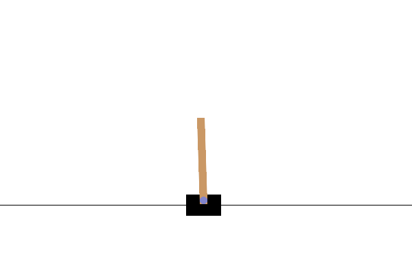
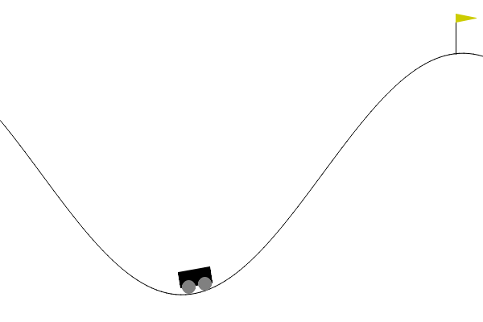

# RL Training Framework

This project provides a flexible framework for training reinforcement learning (RL) agents with minimal setup.  
The algorithms are implemented from scratch using PyTorch.
You can specify configurations for:

- **Model architectures** (CNNs, fully-connected networks, etc.)  
- **Environments** (Gymnasium tasks, including classic control and Atari games)  
- **Training settings & algorithms** (DQN, DDQN, VPG, TD3, SAC, etc.)  

By defining your setup in a single YAML file, you can easily experiment with different models, games, and training hyperparameters without changing the source code.

To train agent:
    python train.py --config configuration.yaml

To run your agent:
    python test.py --model models/model.pt
  

Here are some examples:
---

  
  
    

  
  

Note that training an agent on Pong requires more time and modifying the environment to randomize serves, so that the agent does not overfit a single sequence of moves as shown above.

## YAML Configuration Documentation

Mandatory and optional arguments. Optional does **NOT** mean irrelevant; it simply means the values have defaults and do not need to be specified every time.

For examples of the .yaml configurations, see best_models/.

⚠️ **Note on scientific notation:** In YAML, numbers like `1e-4` are treated as strings. Use floats such as `1.0e-4` instead.

---

### `game`
- **`name`** (Mandatory): Name of the game environment (used for naming model and run files).  
- **`version`** (Mandatory): Official Gymnasium environment ID (e.g., `CartPole-v1`, `MountainCar-v0`, `ALE/Pong-v5`).  
- **`max_episode_steps`** (Optional): Maximum steps per episode. Default: environment’s own setting; use `-1` for no limit.  
- **`render_mode`** (Optional): Rendering mode (`human`, `rgb_array`).  
- **`frame_stack`** (Optional): Number of frames to stack. Default: `1`.  
- **Atari environments** are automatically resized to `(84, 84)` and gray-scaled.  

---

### `training`
- **`alg`** (Mandatory): RL algorithm type.  
- **`double_dqn`** (Optional, DQN only): Use Double DQN. Default: `False`.  
- **`time_steps`** (Mandatory): Total number of training steps.  
- **`save_model`** (Mandatory): Save model file (`true` or `false`).  
- **`vectorized`** (Optional): Use vectorized envs for multiprocessing. Default: `False`.  
- **`num_envs`** (Optional/Mandatory if vectorized): Number of envs for multiprocessing.  
- **`name_tag`** (Optional): Tag for naming files. Default: `""`.  

---

### `model`
- **`continuous`** (Optional): Action space type. Must be `false` for DQN, `true` for TD3. Default: `false`.  
- **`nn_type`** (Mandatory): Network type (`DNN`, `CNN`, etc.).  
- **`loss`** (Mandatory): Loss function (`MSE`, `CrossEntropy`, etc.).  
- **`layer_args`** (Mandatory): List of layer configs:  
  - `layer_type` (e.g., `fcl`, `conv`, `pooling`, `flatten`)  
  - `n_out` (units/filters)  
  - `kernel_size` (int or tuple)  
  - `stride` (Optional, default: `1`)  
  - `padding` (Optional, default: `0`)  
  - `pooling_type` (Optional: `max`, `avg`)  

---

### `parameters`
- **`lr`** (Mandatory/Alg-specific): Learning rate.  
- **`lr_critic`** / **`lr_actor`** (Mandatory/Alg-specific): Learning rates for actor-critic methods.  
- **`buffer_size`** (Mandatory): Replay buffer size.  
- **`learning_starts`** (Optional): Steps before training starts. Default: `1`.  
- **`batch_size`** (Optional): Training batch size. Default: `64`.  
- **`tau`** (Optional): Polyak update coefficient. Default: `0.005`.  
- **`gamma`** (Optional): Discount factor. Default: `0.99`.  
- **`optimizer_type`** (Mandatory): Optimizer (`SGD`, `Adam`, etc.).  
- **`train_freq`** (Optional): Update frequency.  
- **`gradient_steps`** (Optional): Gradient steps per rollout.  
- **`noise_type`** (Optional, continuous only): `Gaussian` or `OU`. Default: `Gaussian`.  
- **`policy_delay`** (Optional): Policy update delay (TD3).  
- **`seed`** (Optional): Random seed. Default: `None`.  
- **`epsilon`, `epsilon_min`, `epsilon_decay`, etc.** (Optional, DQN): Epsilon-greedy exploration params.  
- **`target_update_interval`** (Mandatory/Alg-specific): Steps between target network updates.  
